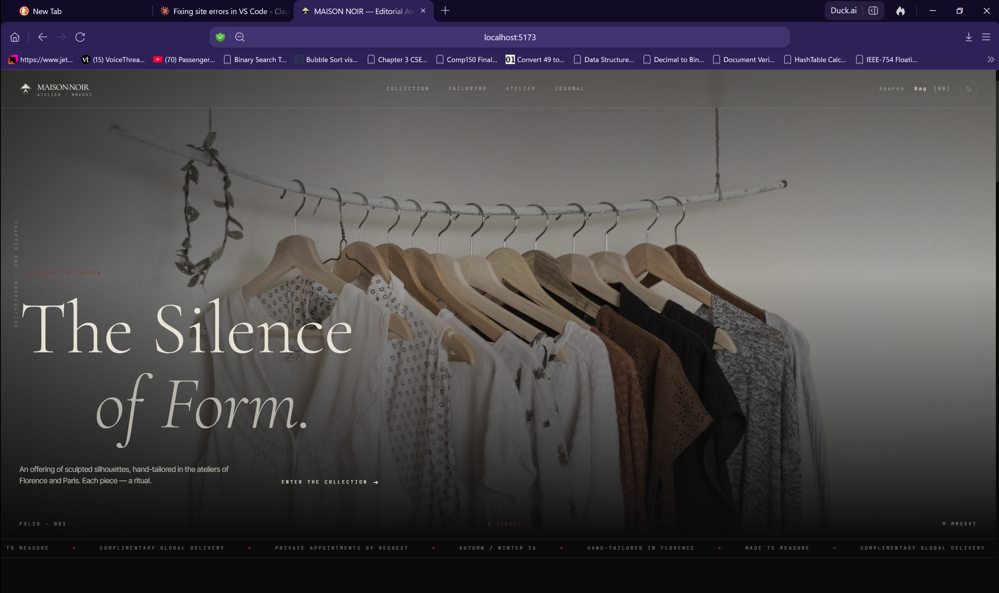
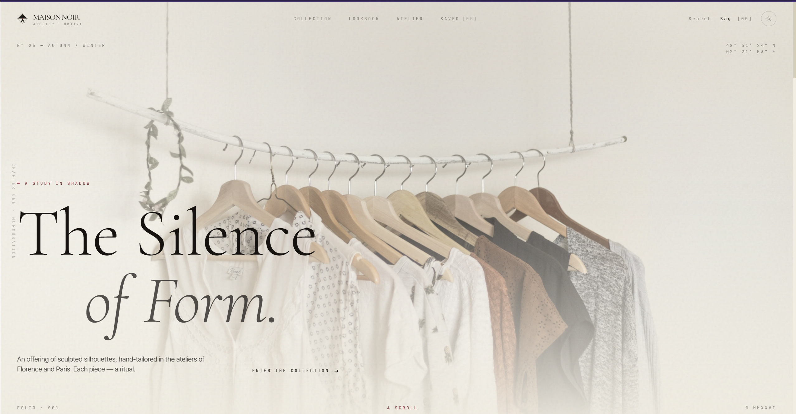
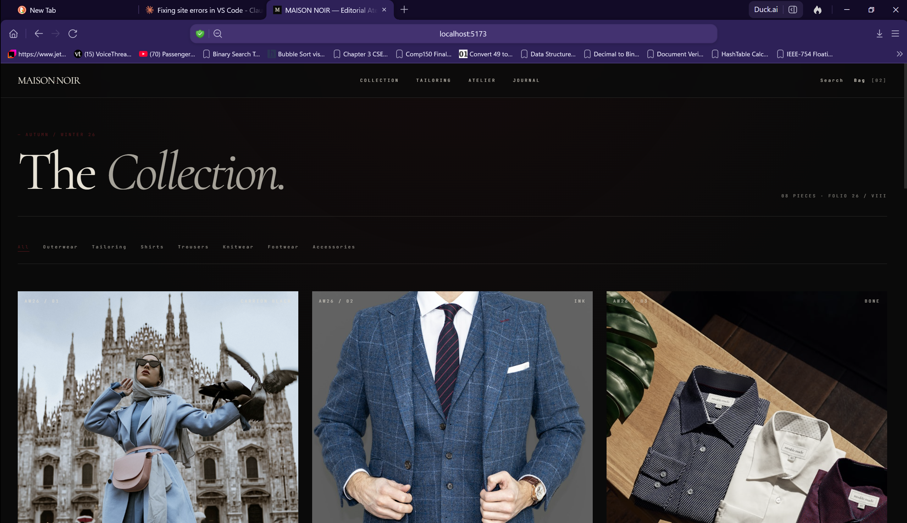
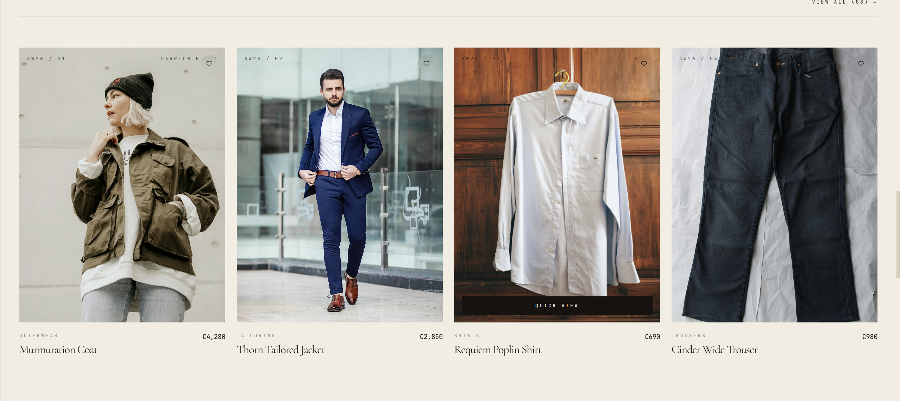
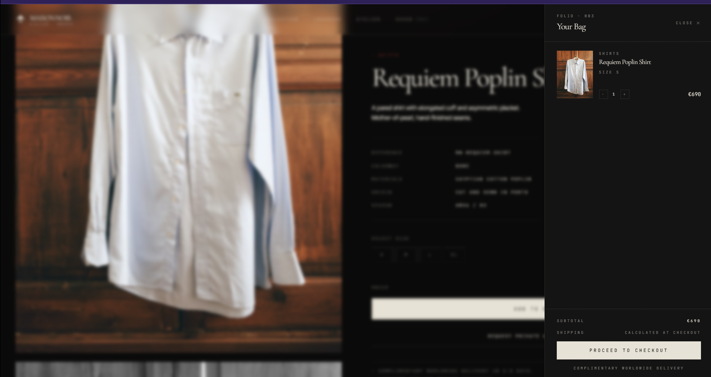
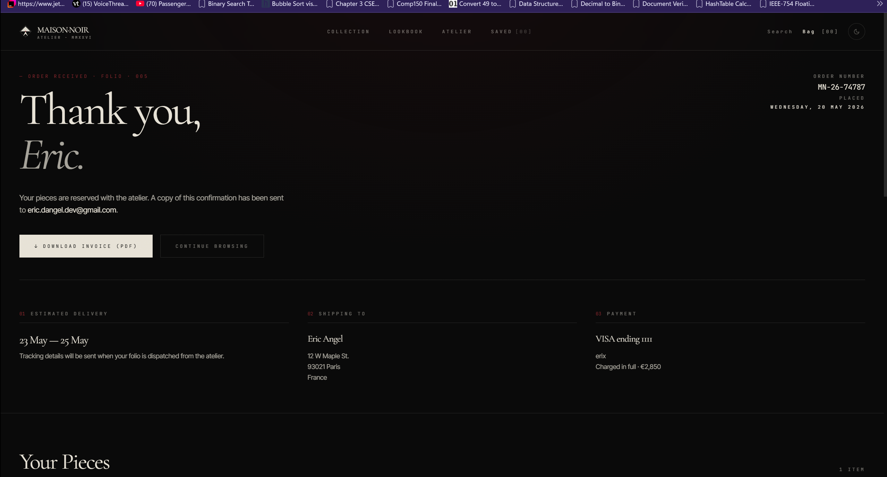
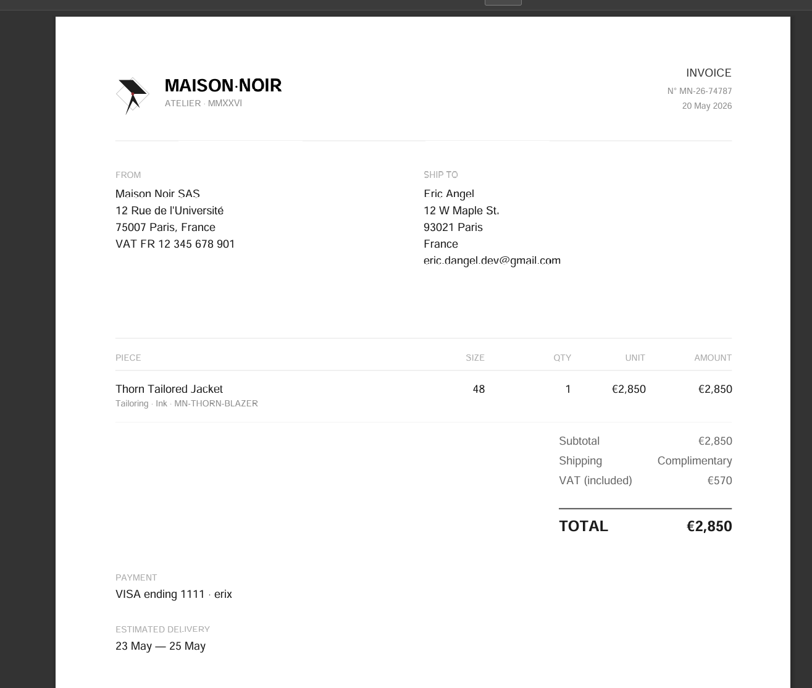
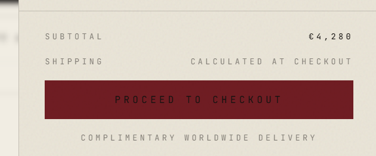

<div align="center">

# MAISON·NOIR

**An editorial fashion storefront built with React, Vite & Tailwind.**

A dark luxury e-commerce concept inspired by Alexander McQueen, Rick Owens, and the editorial conventions of high-end fashion publishing.

[](https://react.dev)
[](https://vitejs.dev)
[](https://tailwindcss.com)
[](https://www.framer.com/motion/)
[](#license)

</div>

---

## Overview

**MAISON·NOIR** is a fictional editorial atelier — a brand concept exploring what a high-end fashion storefront looks like when treated like a publication rather than a product catalog. Every layout, micro-interaction, and piece of copy was designed around a single point of view: *clothing as ritual, the storefront as folio*.

This is a frontend-only project. All products, transactions, and orders are mock — but the checkout flow, validation, and PDF invoice generation are fully functional client-side.

---

## Screenshots
## Screenshots

### Home



### Collection



### Product


### Checkout & Confirmation




### Brand Details



```
/screenshots
  hero-dark.png
  hero-light.png
  collection.png
  product.png
  lookbook.png
  checkout.png
  confirmation.png
  invoice.png
```

<!--


-->

---

## Features

### Design System
- **Dual theme** (auto-detects OS preference, manual toggle persists across sessions)
- **Custom typography stack** — Cormorant Garamond (display), Inter Tight (body), JetBrains Mono (labels)
- **CSS-variable architecture** — every color flows from `:root` tokens for true theme parity
- **Editorial details** — grain overlays, radial gradients, hairline borders, rotated vertical text, marquee tickers, Roman numerals

### Brand Identity
- **Custom SVG sigil** — drawn from scratch as a React component, scales infinitely, inherits theme color
- **Animated brand reveal** on first session visit (path-drawn loading screen)

### Storefront
- **Cinematic hero** with staggered text reveals and parallax-ready layout
- **Filterable collection grid** with category routing via URL params
- **Product detail page** with sticky info panel, multi-image stack, full specs
- **Quick-view modal** — preview products without leaving the grid (Esc to close)
- **Full-screen search** — `Cmd/Ctrl+K` shortcut, live filtering across name, category, colorway, and materials
- **Wishlist** — heart icon on every card, persists across sessions via `localStorage`
- **Editorial lookbook** — parallax full-bleed spreads with scroll-triggered storytelling

### Cart & Checkout
- **Sliding cart drawer** with quantity controls and body-scroll lock
- **Two-column checkout** with progressive disclosure (sections unlock as previous fields validate)
- **Smart form UX:**
  - Card number auto-formats with spaces and detects brand (Visa / Mastercard / Amex / Discover)
  - Expiry auto-formats to `MM / YY` with not-in-the-past validation
  - Luhn algorithm validation for card numbers
  - CVV swaps to 4 digits when Amex is detected
  - Postal codes auto-uppercase
  - Full `autocomplete` hints for browser autofill
- **Processing animation** between submit and confirmation
- **Order confirmation** with order number, delivery estimate, address echo, and itemized breakdown
- **Real PDF invoice** generated client-side with jsPDF (lazy-loaded — only ~120 KB downloads when the user clicks the button)
- **Order persistence** — confirmation page works after refresh, history saved to `localStorage`

### Performance & Accessibility
- Lazy-loaded heavy dependencies (jsPDF)
- All images use native `loading="lazy"`
- Theme applied before first paint (no flash of wrong theme)
- Keyboard navigation (`Cmd/Ctrl+K` for search, `Esc` closes modals)
- ARIA labels on icon-only buttons
- Decorative duplicate content marked `aria-hidden`
- 404 page for unknown routes

---

## Tech Stack

| Layer | Choice |
|-------|--------|
| **Framework** | React 18 |
| **Build Tool** | Vite 5 |
| **Styling** | Tailwind CSS 3 (with CSS variable theming) |
| **Motion** | Framer Motion 11 |
| **Routing** | React Router 6 |
| **PDF Generation** | jsPDF (lazy-loaded) |
| **State** | React Context + `useReducer` |
| **Persistence** | `localStorage` (wishlist, theme, orders) + `sessionStorage` (loading screen) |
| **Type Safety** | Plain JS (no TypeScript — kept simple for portfolio readability) |

---

## Setup

### Prerequisites
- **Node.js 18+** ([download](https://nodejs.org))
- **npm** (comes with Node)

### Install

```bash
# Clone
git clone https://github.com/blackapple805/maison-noir.git
cd maison-noir

# Install dependencies
npm install

# Start dev server
npm run dev
```

Open [http://localhost:5173](http://localhost:5173) in your browser.

### Build for production

```bash
npm run build
npm run preview
```

The production build outputs to `/dist`.

---

## Project Structure

```
src/
├── components/
│   ├── Nav.jsx              # Top navigation with theme toggle
│   ├── Hero.jsx             # Cinematic landing hero
│   ├── Logo.jsx             # SVG sigil + wordmark
│   ├── Marquee.jsx          # Scrolling editorial ticker
│   ├── ProductCard.jsx      # Grid card with quick-view + wishlist
│   ├── CartDrawer.jsx       # Sliding bag panel
│   ├── QuickView.jsx        # Product preview modal
│   ├── SearchOverlay.jsx    # Cmd+K full-screen search
│   ├── ThemeToggle.jsx      # Sun/moon switcher
│   ├── LoadingScreen.jsx    # First-visit brand intro
│   ├── Footer.jsx           # Site footer with newsletter
│   └── Field.jsx            # Reusable form input
│
├── context/
│   ├── ThemeContext.jsx     # Dark/light theme, system preference
│   ├── CartContext.jsx      # Cart state + reducer
│   ├── WishlistContext.jsx  # Saved pieces persistence
│   └── OrderContext.jsx     # Order placement and history
│
├── pages/
│   ├── Home.jsx             # Landing
│   ├── Collection.jsx       # Filterable product grid
│   ├── Product.jsx          # Product detail
│   ├── Lookbook.jsx         # Editorial scroll spreads
│   ├── Atelier.jsx          # Brand story
│   ├── Wishlist.jsx         # Saved pieces
│   ├── Checkout.jsx         # Two-column form flow
│   ├── Confirmation.jsx     # Order confirmation + PDF
│   └── NotFound.jsx         # 404
│
├── data/
│   └── products.js          # Mock catalog
│
├── utils/
│   ├── card.js              # Luhn, brand detection, formatters
│   └── invoice.js           # jsPDF invoice generator
│
├── App.jsx                  # Routes + providers
├── main.jsx                 # Entry point
└── index.css                # Tailwind + CSS variable tokens
```

---

## Routes

| Path | Description |
|------|-------------|
| `/` | Home |
| `/collection` | Product grid |
| `/collection?cat=Tailoring` | Filtered by category |
| `/product/:id` | Product detail |
| `/lookbook` | Editorial spreads |
| `/atelier` | Brand story |
| `/wishlist` | Saved pieces |
| `/checkout` | Checkout flow |
| `/confirmation/:number` | Order confirmation |
| `*` | 404 |

---

## Keyboard Shortcuts

| Key | Action |
|-----|--------|
| `Cmd/Ctrl + K` | Open search |
| `Esc` | Close any modal or overlay |

---

## Customization

### Brand name
Search the codebase for `MAISON·NOIR` and replace with your brand. Update the `<title>` in `index.html` and the favicon SVG inline.

### Color palette
Edit `src/index.css`:

```css
:root, [data-theme='dark'] {
  --bg: #0A0A0A;     /* page background */
  --fg: #E8E2D5;     /* text color */
  --accent: #9C1B2A; /* oxblood accent */
  /* ... */
}

[data-theme='light'] {
  --bg: #F2EDE2;
  --fg: #161210;
  --accent: #7A1220;
}
```

### Products
Replace mock data in `src/data/products.js`. Each product needs:

```js
{
  id: 'unique-slug',
  name: 'Display Name',
  category: 'Outerwear',
  season: 'AW26 / 01',
  price: 4280,
  colorway: 'Carrion Black',
  materials: 'Wool · Silk',
  origin: 'Hand-tailored in Florence',
  description: 'Long-form editorial description.',
  image: 'https://path-to-image.jpg',
  sizes: ['S', 'M', 'L'],
}
```

### Hero image
Edit `src/components/Hero.jsx` and replace the Unsplash URL.

### Lookbook spreads
Edit the `spreads` array in `src/pages/Lookbook.jsx`.

---

## Testing the Checkout

Use these standard test card numbers (all pass Luhn validation):

| Card | Number | CVV |
|------|--------|-----|
| Visa | `4111 1111 1111 1111` | any 3 digits |
| Mastercard | `5555 5555 5555 4444` | any 3 digits |
| Amex | `3782 822463 10005` | any 4 digits |
| Discover | `6011 1111 1111 1117` | any 3 digits |

Use any future expiry date (`12 / 28` works).

No real payment is processed — the order is saved to `localStorage` and a PDF invoice is generated client-side.

---

## Deployment

### Vercel (recommended)
```bash
npm install -g vercel
vercel
```
Or connect the GitHub repo at [vercel.com/new](https://vercel.com/new) for automatic deploys on every push.

### Netlify
Build command: `npm run build`
Publish directory: `dist`

### Other hosts
Any static host works. Build with `npm run build` and serve the `/dist` folder.

---

## Roadmap

Potential next steps if extending into a real project:

- [ ] Real backend (Supabase / Firebase) for products and orders
- [ ] Real payment (Stripe Checkout or Elements)
- [ ] Real transactional email (Resend, EmailJS, or SendGrid)
- [ ] Customer accounts with order history
- [ ] CMS integration (Sanity, Contentful) for product editing
- [ ] Multi-language support (i18n)
- [ ] Product image galleries with zoom
- [ ] Real shipping rate API (EasyPost, ShipStation)
- [ ] Inventory management
- [ ] Analytics (Plausible, PostHog)

---

## Credits

- **Product photography** — [Unsplash](https://unsplash.com) (CC0 license)
- **Typefaces** — [Google Fonts](https://fonts.google.com)
- **Icons** — Custom SVG, hand-drawn

---

## License

MIT © 2026 — built as a portfolio piece. Free to fork, learn from, and adapt.

---

<div align="center">

**Built by [Eric Del Angel](https://github.com/blackapple805)**

</div>
